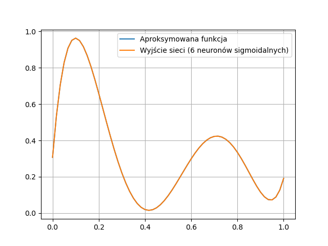
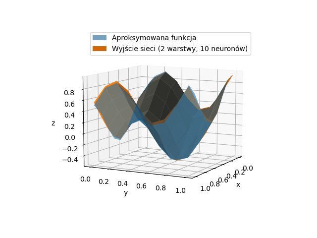

# libnn - library for training neural networks

This is just a test. I do not intend to maintain
this library long term.

The library can train a network
defined in form of directed acyclic
graph. Currently there are three
types of neurons: Constant (fixed output),
sigmoid and sum. 

# Content

This repository contains libnn library code
in `libnn` directory and simple demo demonstrating
use of this library in `demo` directory.

|  |
| :--: |
| *Results of function approximation by  
   network with 6 sigmoidal neurons.* |

|  |
| :--: |
| *Results of 2D function approximation by  
   network with 2 layers with 5 sigmoidal  
   neurons each.* |
